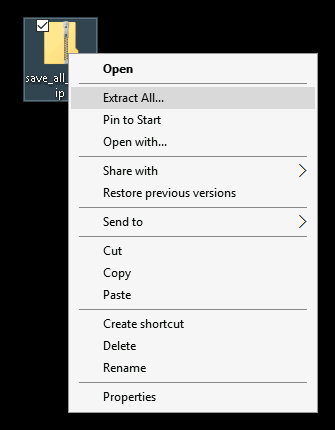
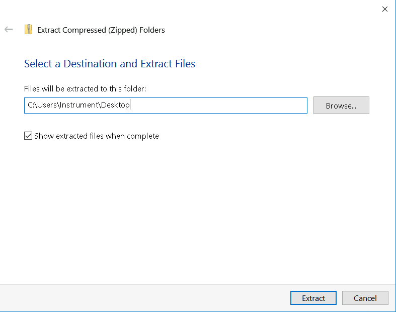
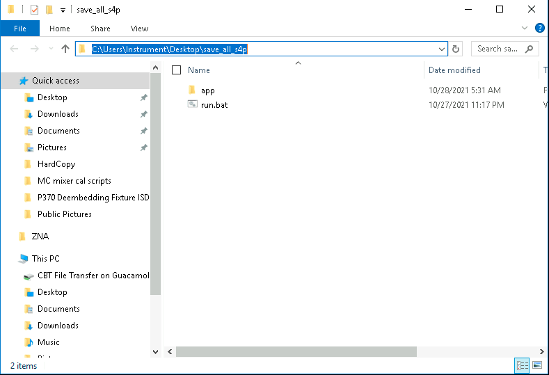
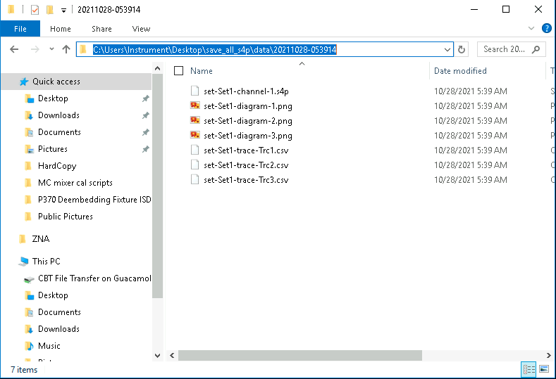

# Save All S4P

Saves all available S4P files from data already on the VNA.

To be safe, it also saves all trace data to csv and saves screenshots.

## Install

Copy `save_all_s4p.zip` onto the desktop of the VNA. Right-click the file and select `Extract all...`

Set the extract location to the desktop.

The result should be a folder named `save_all_s4p` with the following contents:

Double-click `run.bat` to save all data on the VNA. Data is saved in the `data/` folder, organized by timestamp.

